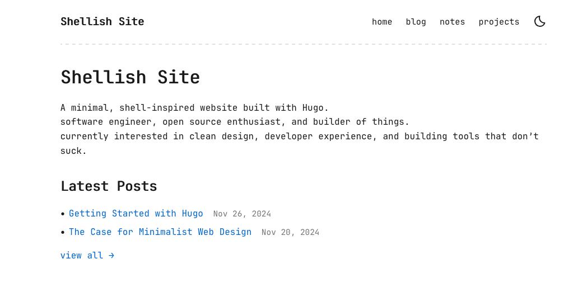

# Hugo Shellish Theme

A clean, minimal shell/terminal-inspired Hugo theme with a focus on simplicity and readability.

## Features

- **Minimal Design**: Clean, distraction-free interface inspired by shell environments
- **Monospace Typography**: Terminal-like aesthetic with monospace fonts throughout
- **Responsive**: Mobile-friendly responsive design
- **Fast**: No JavaScript frameworks, pure CSS and minimal HTML
- **SEO Friendly**: Proper meta tags, sitemap, and RSS support
- **Dark Theme**: Dark background with light text for comfortable reading
- **Tags & Categories**: Built-in support for organizing content
- **Self-linking Headings**: Headings display a `#` symbol on hover and are clickable to create anchor links
- **Notes Section** (Optional): A lightweight section for short posts and links alongside your blog

---

<p align="center">

</p>

## Installation

### For a new site:

```bash
hugo new site my-site
cd my-site
git init
git submodule add https://github.com/markw/hugo-shellish themes/hugo-shellish
```

### For an existing site:

```bash
git submodule add https://github.com/markw/hugo-shellish themes/hugo-shellish
```

Then update your `config.toml`:

```toml
theme = "hugo-shellish"
```

## Configuration

Copy the example config from `exampleSite/config.toml` and customize for your needs:

```toml
baseURL = "https://yourdomain.com/"
languageCode = "en-us"
title = "Your Site Title"
theme = "hugo-shellish"

[params]
  author = "Your Name"
  description = "Your site description"
  showBreadcrumbs = true
  showNotes = true
  
  [params.social]
    github = "yourusername"
    twitter = "yourusername"
    linkedin = "yourusername"
    rss = true
```

## Content Structure

### Creating a new post:

```bash
hugo new blog/my-first-post.md
```

### Creating a project:

```bash
hugo new projects/my-project.md
```

### Creating a note:

```bash
hugo new notes/my-note.md
```

Notes are optional and appear alongside blog posts on the home page (in a two-column layout on desktop, single column on mobile). To disable notes, set `showNotes = false` in your config.

## Customization

### Colors

Edit the CSS variables in `assets/css/style.css`:

```css
:root {
  --bg-color: #0d1117;
  --text-color: #c9d1d9;
  --accent-color: #58a6ff;
  --border-color: #30363d;
  --code-bg: #161b22;
}
```

### Fonts

Change the monospace font by modifying `--font-mono` in `assets/css/style.css`:

```css
--font-mono: 'JetBrains Mono', monospace;
```

## Section Organization

The theme supports different content sections. Configure menu items in your config:

```toml
[menu]
  [[menu.main]]
    name = "home"
    url = "/"
    weight = 1
  [[menu.main]]
    name = "blog"
    url = "/blog"
    weight = 2
```

# Icons

This theme uses icons from [Flowbite Icons](https://flowbite.com/icons/) which are licenced under the MIT License.

## Acknowledgments

This theme was developed with assistance from AI tools. All code has been reviewed and tested to ensure quality and correctness.

## License

Released under MIT License - Copyright [Mark Wolfe](https://www.wolfe.id.au).

## Support

For issues, feature requests, or contributions, visit the [GitHub repository](https://github.com/markw/hugo-shellish).
